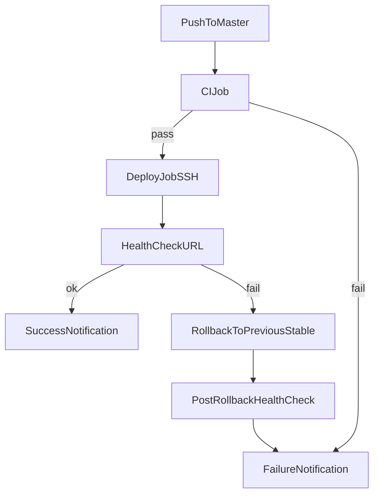

# GitHub Actions CI/CD с Rollback

## Цел
Да се въведе надежден deploy процес при push към `master`, който:
- валидира кода (build/test),
- деплойва към production сървъра по SSH,
- прави health check,
- при грешка автоматично връща последната стабилна версия.

## Критични принципи за устойчивост
- Docker image-ите се тагват с commit SHA (например `${GITHUB_SHA}`), а не само с `latest`.
- Деплой и rollback се изпълняват по конкретен image tag, за да се избягват неочаквани промени.
- Последният стабилен image tag се пази (например в `.last_stable_image`) само след успешен health check.
- CI failure, skipped jobs и rollback failure винаги генерират уведомление (без "тихи" сценарии).

## Какво ще променим
- Поправка и пълно пренаписване на workflow файла в `.github/workflows/deploy.yml` (файлът в момента е невалиден YAML и съдържа само фрагмент за Telegram).
- Добавяне на ясно разграничени jobs:
  - `ci` (checkout + install + test/build),
  - `deploy` (SSH deploy на сървъра),
  - `healthcheck_and_rollback` (проверка и rollback при fail),
  - `notify` (success/failure Telegram).

## Поток на deploy и rollback

## Детайли по внедряване
- Trigger: `on.push.branches: [master]` + `workflow_dispatch` за ръчен старт.
- Concurrency guard: само един deploy в даден момент (`concurrency`), за да няма race conditions.
- SSH deploy стъпки (remote script):
  - `cd` до project dir на сървъра,
  - `git fetch --all`,
  - запазване на текущия стабилен SHA (например в `.last_stable_sha`),
  - `git checkout master && git pull`,
  - build/tag/push на Docker image с commit SHA (или pull от registry по SHA tag),
  - `docker compose up -d` с новия `APP_IMAGE_TAG`.
- Health check:
  - `curl` към production endpoint (например `/api/health` или наличен стабилен endpoint),
  - retry логика (няколко опита с пауза), за да не фейлне заради бавен старт.
- Rollback:
  - при неуспешен health check: връщане към предишния стабилен `APP_IMAGE_TAG`,
  - `docker compose up -d` за стартиране на последния работещ image,
  - финален health check и лог/нотификация за rollback резултата.
- Notifications:
  - Telegram success/failure стъпките остават, но логиката отчита и `failure`, `cancelled`, `skipped`.

## Бележки за git rollback и Detached HEAD
- Ако временно се ползва rollback по commit SHA (`git checkout <sha>`), това води до Detached HEAD.
- За да не се счупи следващ deploy, workflow трябва изрично да връща репото към `master` в края на rollback процедурата.
- Препоръчителен дългосрочен подход: rollback по Docker image tag вместо rollback по git checkout.

## Docker Compose надеждност
- `docker-compose.yml` трябва да използва image с променлива tag (например `${APP_IMAGE_TAG}`), за да превключва версии без rebuild.
- Добра практика е да има service-level `healthcheck` в compose, а не само външен `curl`.
- `container_name` е опционален; полезен е за диагностика (`docker logs/exec`), но не е задължителен, ако health check е по URL.

## Логика за notify при skipped jobs
- `notify` job трябва да е с `if: always()`.
- Success известие: само ако всички критични jobs са `success`.
- Failure известие: при `failure`, `cancelled` или `skipped` в `ci`, `deploy` или `healthcheck_and_rollback`.

## Secrets и конфигурация
Ще се използват следните GitHub Repository Secrets:
- `SSH_HOST`, `SSH_USER`, `SSH_KEY`, `SSH_PORT`
- `SERVER_APP_PATH` (абсолютен път на проекта на сървъра)
- `APP_HEALTHCHECK_URL`
- `TELEGRAM_TO`, `TELEGRAM_TOKEN`

## Валидация
- Проверка на YAML синтаксис и GitHub Actions структура.
- Dry-run логика чрез `workflow_dispatch` за валидиране на стъпките.
- Потвърждение, че rollback се активира при симулиран fail на health check.
- Потвърждение, че rollback стартира предишния стабилен image tag.
- Тест за CI failure сценарий: трябва да има failure notification, дори `deploy` и `healthcheck` да са skipped.
- Тест за post-rollback failure: workflow остава failed и изпраща критично известие.

## Засегнати файлове
- `.github/workflows/deploy.yml`
- `README.md` (опционално: секция за deployment secrets и runbook)
